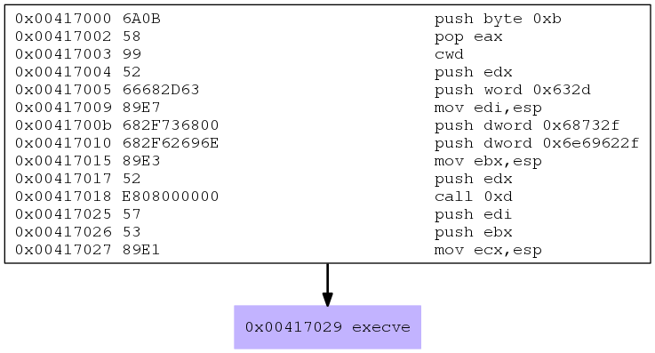

# SLAE Exam Assignment 5 - Analyzing MSFVenom payloads

## Prologue
The fifth assignment for our SLAE certification exam is analyzing three shellcodes from the Metasploit MSFVenom tool and writing a suitable report for the same.

Almost all of us have used the Metasploit framework's `msfvenom` tool at some point and generated some payloads and used it somewhere but have you ever thought how does it function? How is it made?

If your answer is no then this is your chance to peek a glimpse at everything that happens under the hood of this powerful tool when you generate a payload.

For the purposes of this blog post I have chosen three payloads namely:
1. linux/x86/exec
1. 
1.

So without any further ado, here it it goes.

## Analyzing linux/x86/exec CMD=/bin/sh
As might be evident from the name, this is an execve shellcode and you can specify what to execute using the `CMD=` flag. Let's go ahead with `/bin/sh`.

We can generate the shellcode C-string using this command:
```
msfvenom -p linux/x86/exec CMD=/bin/sh --arch x86 -f c
```

The generated shellcode is as follows:
```
[-] No platform was selected, choosing Msf::Module::Platform::Linux from the payload
No encoder or badchars specified, outputting raw payload
Payload size: 43 bytes
Final size of c file: 205 bytes
unsigned char buf[] = 
"\x6a\x0b\x58\x99\x52\x66\x68\x2d\x63\x89\xe7\x68\x2f\x73\x68"
"\x00\x68\x2f\x62\x69\x6e\x89\xe3\x52\xe8\x08\x00\x00\x00\x2f"
"\x62\x69\x6e\x2f\x73\x68\x00\x57\x53\x89\xe1\xcd\x80";
```

But this is basically an array of opcodes and doesn't make much sense does it eh?

Honestly it'd be good if we could look at the NASM source or better yet a visual representation of the flow right?

Fortunately enough for us there's a powerful tool known as `libemu` which allows us to do the same and more.

Assuming you have already installed the tool, let's look at how to generate a graph:
```
msfvenom -p linux/x86/exec CMD=/bin/sh --arch x86 -f raw | sctest -vvv -Ss 100000 -G linux-x86-exec.dot
dot linux-x86-exec.dot -Tpng -o linux-x86-exec.png
```

Let me paste the image here for detailed analysis:


